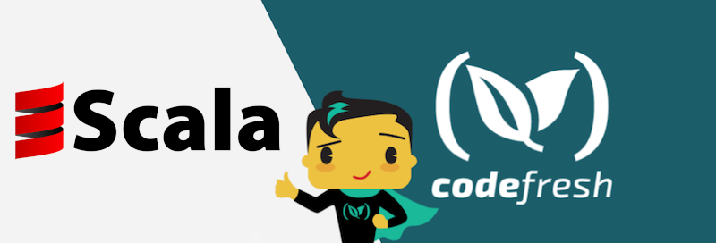

# Using Scala and Codefresh to clone/package source code, and build a Docker image


## The Example Scala Application

This project uses `Scala` to build an application which will eventually become a distributable Docker image.

## Build in Codefresh

- [Example single stage pipeline](codefresh-single-stage.yml)
- [Example multi-stage pipeline](codefresh-multi-stage.yml)


See the [documentation](https://codefresh.io/docs/docs/learn-by-example/scala/scala-hello-world/) for more details.


## Build Locally

This is a simple example of how to create Docker image for a Scala
application.

To build the Docker image, run following command:

```
$ docker build -t codefresh-contrib/scala-hello-world-sample-app:1.0 .
```

To run the docker image, run following command:
```
$ docker run -it codefresh-contrib/scala-hello-world-sample-app:1.0
```
Original source: https://github.com/yzhong52/HelloDockerScalaSbt
